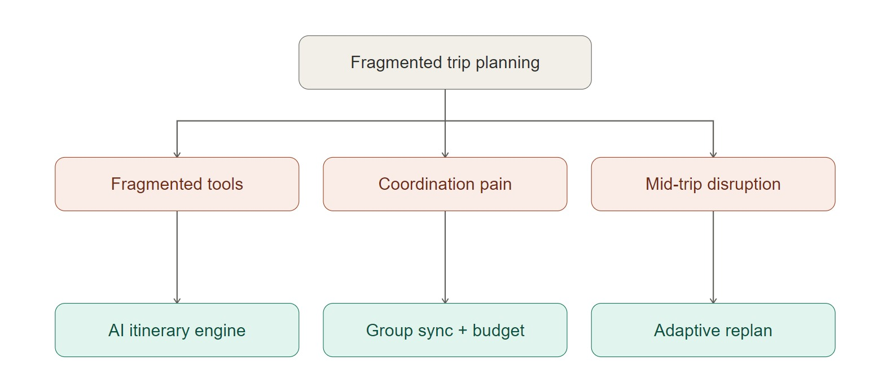
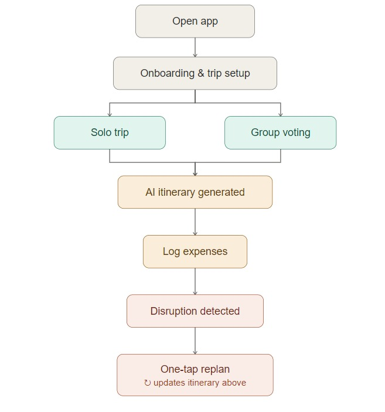

# TravelMate by ________QuBits___________

**Team:** MUHAMMAD IRFAN BIN DHAJUDEEN, NUR AMALINA QISTINA BINTI MOHD YUNUS, NURUL ALWANI BINTI MOHD ARIF

**Problem Statement:** Travel Planner

**Video Presentation:** [Unlisted YouTube Link — ___________________]

**Prototype Link:** [ travelmate-prototype.vercel.app](https://travelmate-prototype.vercel.app/)

---

## 1. Project Overview

### The Problem

Travelers currently juggle 5+ separate apps to plan a single trip: booking apps for flights and hotels (Skyscanner, Booking.com), budget trackers for expenses (spreadsheets, Splitwise), itinerary planners for schedules (TripIt, Wanderlog), group coordination tools for preferences (WhatsApp, Slack), and weather apps for contingency planning. None of these tools talk to each other, so information gets lost, miscommunication is constant, and the moment something goes wrong mid-trip — a delayed flight, a change of plans — there's no single tool that helps the group adjust quickly.

This gets worse in three specific situations: **group trips**, where coordinating across multiple people multiplies complexity; **international travel**, where currency, language, and unfamiliar logistics add friction; and for **first-time travelers**, who lack experience and rely heavily on tools to fill the gap.

**Stakeholders:** solo travelers, group trip organizers, travel companions, and — indirectly — travel service providers who lose customers to planning friction and abandoned trips.

**Similar apps and why they fall short:** Wanderlog is the closest existing competitor — it handles itinerary building well, but has no budget tracking, no group preference voting, and critically, no way to handle disruptions once a trip is underway. TripIt organizes bookings you've already made but doesn't help you plan or coordinate a group. Splitwise handles cost-splitting well but knows nothing about your itinerary. None of them talk to each other, which is exactly the fragmentation problem TravelMate exists to solve.

### Our Solution

TravelMate is an all-in-one mobile trip planner that replaces the 5+ apps travelers currently juggle with one app built around a single idea: ask a few questions once, hand back a living plan, and fix it automatically when things go wrong. An AI-and-algorithm hybrid builds a day-by-day itinerary from your budget, dates, and interests; groups vote on activities and get a fair compromise instead of endless group-chat arguments; every expense is logged and split automatically; and when a flight gets delayed or weather changes plans, the app replans the affected day with one tap instead of leaving the group stranded and confused.

**Feature set:**
- **AI itinerary engine** — auto-generates a day-by-day schedule from destination, dates, budget, and interests
- **Group sync hub** — invite, vote on activities, and get an automatic compromise between majority and minority preferences
- **Budget tracker** — log expenses, see category breakdowns, split costs automatically across the group
- **Adaptive replan** — one tap regenerates the affected day when a flight delays or weather shifts — our key differentiator
- **Map integration** — every activity pinned on a map, plus a nearby-suggestions layer for attractions, restaurants, and hotels
- **Live group location & SOS** — opt-in live location sharing among group members, plus a manual "I need help" alert
- **Group announcements** — one-way broadcast ("leaving in 5, meet at the lobby") without opening full chat
- **Google Calendar sync** — check when the whole group is actually free before locking in dates, then block everyone's calendar once confirmed
- **Personal checklist** — AI-generated starter list (passport, cash, packing, adapted to destination/season) per traveler, with manual add on top
- **Profile & multi-trip support** — account info plus a "My Trips" list (planning/upcoming/completed/cancelled); starting a new trip doesn't require finishing or cancelling an existing one
- **Offline access (PDF)** — download a printable copy of your itinerary, checklist, and budget, so it's usable even with no signal

---

## 2. Ideation & Process

### 2.1 Ideas We Considered

| Idea | Why it was dropped / kept |
|---|---|
| **TravelMate — all-in-one trip planner** (Chosen) | Covers all the pain points identified (booking friction, budget chaos, itinerary fragmentation, group conflict, mid-trip disruption) in one cohesive app, instead of solving just one piece of a problem that's fundamentally about fragmentation across tools. |
| Flight-Only Delay Tracker — notifies users of delays and suggests airport lounges | Dropped: too narrow, only solves 1 of the 5 identified pain points. |
| Group Expense Splitter for Trips — Splitwise, but travel-focused | Dropped: useful in isolation, but single-purpose — doesn't address the underlying fragmentation problem, just replaces one app in the stack with another. |

### 2.2 Ideation Boards

**Problem tree** — mapped the core problem (fragmented tools, group coordination pain, mid-trip disruption) down to the specific features that address each branch (itinerary engine, group sync hub, budget tracker, adaptive replan).



**User flow diagram** — traced the path from opening the app through solo/group branching, AI itinerary generation, expense logging, and the disruption-replan loop. This became the basis for the app's actual navigation model (linear onboarding, tab-based main app).



**Iteration history:**

| Version | What Changed | Why |
|---|---|---|
| V1 — Initial concept | Simple itinerary builder with map integration | Felt too similar to Wanderlog, no real novelty |
| V2 — Added group voting | Let friends vote on activities to find compromise | Addressed group coordination but still felt incomplete |
| V3 — Added budget splitter | Integrated expense tracking and cost splitting | Now covered itinerary + group + budget, but missed disruption handling |
| V4 — Dropped live booking APIs | Cut Skyscanner/Booking.com integration for prototype | Too ambitious for the timeline; mocked data instead, focused on UX flow |
| V5 — Added Adaptive Replan | One-tap replan when flights delayed or weather shifts | Became the standout differentiator — no competitor does this well |

### 2.3 Mentor Consultation

| Date | Mentor | Feedback Received | What Was Changed |
|---|---|---|---|
|03/09/2026 | Umi Kalsum(College Lecturer) | "Live booking APIs will eat a huge chunk of your time. Mock the data and focus on the UX flow." | Removed live API integration, created a mocked dataset instead, freeing time for design. |
| 03/09/2026 | Umi Kalsum(College Lecturer) | "Your group features are too complex. Start with simple voting before real-time chat." | Simplified group sync to voting + a shared dashboard; cut in-app chat from the prototype scope. |
| 03/09/2026 | Umi Kalsum(College Lecturer) | "Judges want to see the problem clearly. Add a before/after comparison." | Added a "life without TravelMate vs. with TravelMate" comparison to the presentation. |
| 07/09/2026 | Lim Zi Yang(Codenection mentor) | Suggested building the interactive prototype in Next.js instead of Flutter for easier debugging and deployment; suggested adding Google Calendar integration so group members can see when everyone's free and block calendars once a trip is confirmed; suggested exploring a Life360-style live location service for safety. | Built a full Next.js prototype (kept the Flutter build as the reference for the eventual native app, since browsers can't do true background location tracking). Built real Google Calendar integration (freebusy check + calendar blocking, via Google's API). Evaluated Life360 and found it has no public developer API for third-party integration — kept our own already-built live location + SOS feature instead of depending on a closed platform. |

*Note: even where we agreed with mentor feedback, we made our own call on execution — e.g., we kept the Flutter build alongside the Next.js pivot rather than discarding it, since the two serve different purposes (demo prototype vs. real native app).*

---

## 3. Design & Prototype

**UI Prototype:** [Public Link — [travelmate-prototype.vercel.app](https://travelmate-prototype.vercel.app/)_
*(Deploy the Next.js prototype to Vercel — free, no card required — and link it here. Test that it opens in an incognito window before submitting.)*

**Key screens:**

| Screen | What it shows |
|---|---|
| Welcome | First screen — sets the "passport & airmail" visual identity and value proposition |
| Trip Setup | Destination, dates, and budget entry, with real-time flight/hotel suggestions surfaced inline |
| Trip Type (Solo/Group) | The one fork in the whole app — determines whether the user goes straight to their itinerary or through group setup first |
| Group Voting Dashboard | Live vote bars as group members pick between proposed activities — reached after a mocked group-calendar availability check |
| Map | Real embedded map with the day's planned stops, nearby suggestions, and (for group trips) live member locations and an SOS button |
| Budget Overview | Spend-vs-budget ring chart and category breakdown |
| Disruption Alert → Replan | The core differentiator: a flight delay triggers an alert, and one tap regenerates the affected day |
| Personal Checklist | AI-generated starter list (passport, cash, packing) adapted to destination/season, plus manual add |
| Profile & My Trips | Account info and a list of trips in different states — proves a second trip can be planned without finishing or cancelling the first |

---

## 4. What Makes It Different

- **Adaptive Replan** — one tap regenerates a disrupted day's schedule. This is the single feature we found no direct competitor offering well; everything else in the market treats disruption as something you deal with manually.
- **Preference Compromise Engine** — rather than just tallying votes, the app proposes an actual compromise (e.g., "2 museum mornings for the majority, 1 beach afternoon for the minority") instead of leaving the group to argue it out.
- **Budget-aware itinerary generation** — the AI plans within the stated budget from the start, rather than generating a wish-list itinerary and letting the user discover after the fact that it's unaffordable.
- **Live group location & SOS** — added beyond our original scope, once we realized group trips need a safety net for someone getting separated from the group, not just voting and budgeting.

| Feature | Wanderlog | TripIt | Splitwise | Google Maps | WhatsApp | TravelMate |
|---|---|---|---|---|---|---|
| Itinerary building | ✅ | ✅ | ❌ | ❌ | ❌ | ✅ |
| Budget tracking | ❌ | ❌ | ✅ | ❌ | ❌ | ✅ |
| Group preference voting | ❌ | ❌ | ❌ | ❌ | ❌ | ✅ |
| Cost splitting | ❌ | ❌ | ✅ | ❌ | ❌ | ✅ |
| Adaptive replan | ❌ | ❌ | ❌ | ❌ | ❌ | ✅ |
| Live group location/SOS | ❌ | ❌ | ❌ | ❌ | ❌ | ✅ |
| All-in-one | ❌ | ❌ | ❌ | ❌ | ❌ | ✅ |

---

## 5. Technical Architecture & Feasibility

### Tech stack

| Layer | Technology | Why chosen | Constraint to expect |
|---|---|---|---|
| Frontend (prototype) | **Next.js (React)** | Deploys free on Vercel with one push, no app store/emulator needed for judges to try it | Browsers can't do true background GPS — the live-location/SOS feature is demoed but not fully functional the way a native app would make it |
| Frontend (native, paused) | **Flutter** | Cross-platform, one codebase for iOS + Android — kept as the reference build for when native device features are needed | Requires a full native shell to actually ship; currently paused in favor of the Next.js prototype |
| Bridge to native later | **Capacitor** | Wraps the same React/Next.js code to get real background location and push notifications without a second rewrite | Not yet implemented — planned for once the prototype direction is validated |
| Backend (planned) | **Firebase** (Auth, Firestore, Cloud Functions, Cloud Messaging) | Free push notifications built in; no downtime risk on the free tier | Firestore's NoSQL model needs careful schema design for group-trip nested data |
| AI/algorithm service (planned) | **Python + FastAPI** | Python has the best tooling for both the AI layer (Ollama) and the constraint solver (OR-Tools) | Needs to be hosted separately from Firebase — an extra piece of infrastructure to run |
| Scheduling logic (planned) | **Google OR-Tools** (constraint solver) | Deterministic, free, and reliable for "does this fit the budget/time/location" — doesn't hallucinate a plan that doesn't fit | Needs a real constraint model designed (travel time, opening hours) before it's useful |
| AI model (planned) | **Ollama, self-hosted — Qwen3 8B** | Free to run at low volume (fractions of a cent per generation via cloud alternatives were also modeled), full control over prompts | Self-hosting needs its own server (Oracle free tier first, DigitalOcean as the paid fallback) running 24/7 |
| Calendar | **Google Calendar API** (via NextAuth) | Generous free tier; lets the group see mutual availability and block confirmed dates | Checking a group's availability requires every member to individually connect their own Google account — there's no way around this, Google's API can't see a calendar you don't have a token for |
| Maps | **OpenFreeMap** (tiles) + Nominatim (geocoding) | No signup, no API key, no card required, no usage caps — funded by donations | Tiles only, no bundled routing — would pair with a free router (e.g. OSRM) if real route lines are needed later |
| Places/hotel/attraction data | **OpenStreetMap (Overpass API)** | Free, no key, covers attractions, restaurants, and hotels from one source | Data quality/coverage varies more than a commercial provider |
| Flights & real hotel pricing | **Duffel** (search + booking) + **AeroDataBox** (delay/status) | Duffel's pricing scales with actual bookings, not raw traffic — near-$0 until someone actually books; AeroDataBox has a usable free tier | No free alternative exists at real volume — Amadeus, the previous standard free option, fully shut down its self-service developer portal in mid-2026 |
| Weather | **Open-Meteo** | Free, no key — powers disruption detection | — |
| Currency | **Frankfurter API** | Free, no key | — |
| Hosting (AI) | Oracle Cloud "Always Free" ARM tier first, **DigitalOcean** droplet as the confirmed fallback | Costs nothing to try Oracle first; DigitalOcean chosen over cheaper options (e.g. Hostinger) specifically for its Docker support | Free-tier availability varies by region/account, can't be confirmed until tested |

### System architecture (text form)

```
Next.js app (prototype) / Flutter app (paused, native reference)
        │
        ├── Firebase — accounts, trip data, votes, expenses, push notifications
        │
        └── FastAPI service (self-hosted)
                  ├── OR-Tools — solves the actual day-by-day schedule
                  ├── Ollama (Qwen3 8B) — writes it up, handles fuzzy preferences,
                  │                        turns vote counts into worded compromises
                  └── Pulls from: OpenStreetMap, Open-Meteo, Frankfurter,
                                  Duffel, AeroDataBox, Google Calendar
```

### Build plan & scope

**Already built (prototype phase, complete):**
- Full UI for all 15+ screens across onboarding, solo itinerary, group sync, budget, and disruption flows — in both Flutter (native reference) and Next.js (demo prototype)
- Live group location and SOS UI, group announcements, presence indicators
- A Google Calendar availability-check screen in the actual app flow — fully mocked so the prototype runs with zero setup; the real Google OAuth integration exists separately as a reference for later
- A real, live embedded map (OpenStreetMap) with pin overlays for itinerary stops, nearby suggestions, and group members
- A Dockerized self-hosted AI container (Ollama + Qwen3 8B), ready to deploy
- The Next.js prototype itself is fully Dockerized and zero-config — `docker compose up --build` runs the entire app with no API keys, no environment setup, no backend required
- Sign Up / Log In screens, a Profile screen with multi-trip support, a flight/hotel comparison page (multiple options, not just one each), and a genuinely functional offline PDF export (via the browser's native print-to-PDF, not a fake button)
- Complete API contracts (request/response shapes) for every flow, written before implementation, so backend work can proceed without redesigning the frontend

**Planned for the building phase (explicitly scoped, not yet built):**
1. Firebase project setup (Auth, Firestore, using the schema already designed)
2. FastAPI service implementing the already-written API contracts, starting with the Budget endpoints (pure arithmetic, no AI) to validate the auth pattern before tackling AI-backed endpoints
3. OR-Tools constraint model for realistic itinerary scheduling
4. Deploying the Ollama container to a live server
5. Multi-person Google Calendar support (requires each group member's token to be stored and queried individually — a known Google API constraint, not a design flaw)

**Deliberately out of scope for this phase:**
- Real flight/hotel booking (vs. the current discovery-only suggestions) — mocked for now, real integration (Duffel) budgeted for a later phase once there's real usage to justify the cost
- Capacitor native wrapper for real background location — the live-location UI is built and demoable, but the underlying real GPS tracking is a deliberately separate, later phase given how heavily both app stores scrutinize background location permissions
